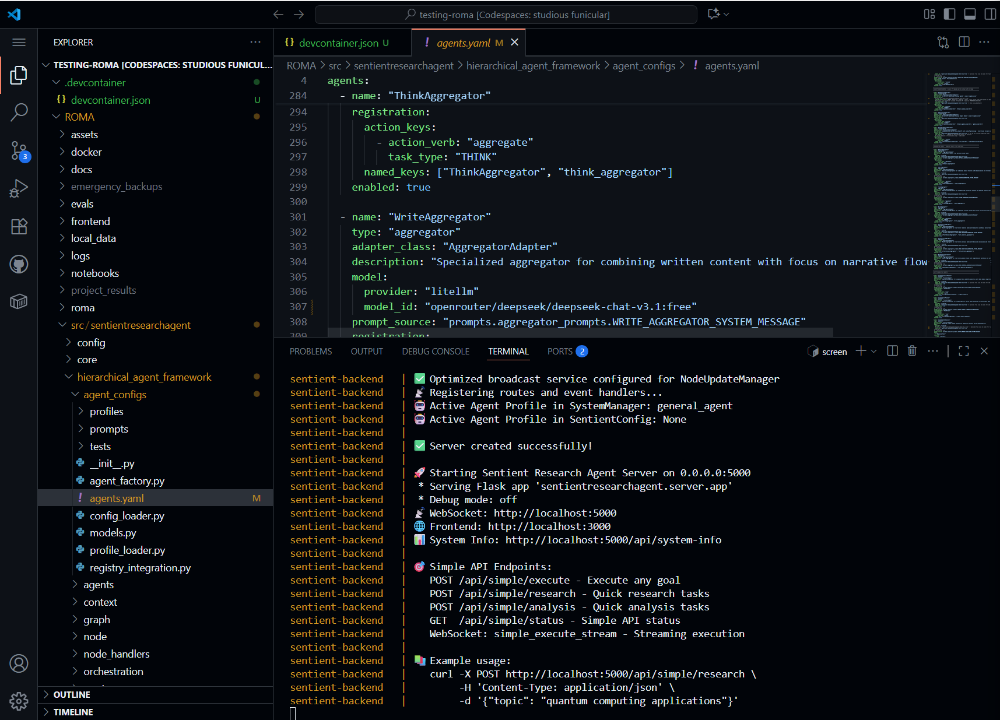
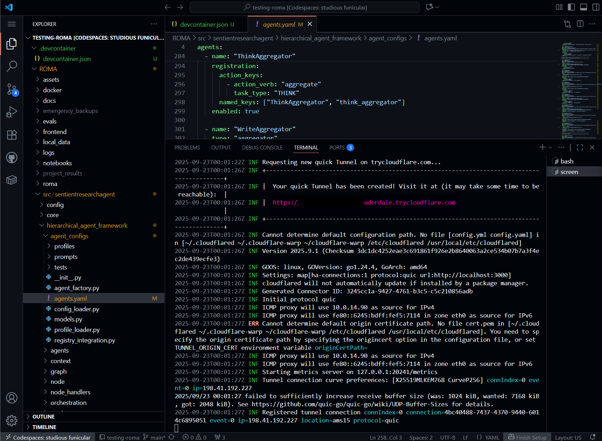

# Comprehensive Guide on How to Tunnel your ROMA Localhost Frontend to a Public URL

---

## Step 1: You'll need a VPS. 

You can get from Contabo.com or PQ Hosting. Contabo is cheaper, you can get a vps for as low as $5 per month, but they only accept card payments and require KYC. 

PQ hosting, however accepts crypto payment and doesn't require KYC, but more expensive and less reliable than Contabo. 

## Step 2: Install ROMA on your VPS with this guide

Visit this url <a href="https://github.com/MikeMoulder/ROMA-VPS-Guide-With-UI-UX/tree/main" target="_blank" rel="noopener noreferrer">ROMA VPS Guide by MikeMoulder</a>

When you get to the end of the above guide, where you're about to restart Docker containers. Come back to this guide

## Step 3: 

Create a new screen

```
screen -S roma
```

## Step 4: 

After creating a new screen, start ROMA with 

```
cd
cd ROMA
cd docker
docker compose down
docker compose up -d
```
You should see something like this:


## Step 5: 
Check if there's any error in your installation. Run the command below 

```
docker compose logs -f
```

## Step 6: 

When you something similar to this image below. 




detach the current screen with CTRL+A, then D

## Step 7: 

create a new terminal with CTRL+SHIFT+C or  click the "+" button at the top right corner of your current terminal 

In the newly created terminal... 

Download and install Cloudfared with:
```
wget https://github.com/cloudflare/cloudflared/releases/latest/download/cloudflared-linux-amd64.deb
sudo dpkg -i cloudflared-linux-amd64.deb
```


Optional: Very cloudfared installation with
```
cloudflared --version
```

## Step 8: 

Create a new screen with: 
```
screen -S frontend
``` 

After creating a new screen, run: 
```
cloudflared tunnel --url http://localhost:3000
```


Localhost:3000 being your frontend localhost. 

This command will give you a public url for testing that you can share with friends. 

- You'll get a url that looks like the image below (if you're not seeing the url, adjust the size of your terminal by dragging the top with your mouse) 

- Copy the url and save it (don't open yet) 

Then, detach the current screen with CTRL+A, then D 

## Step 9:

Create a new terminal. 

Then create a new screen with: 
```
screen -S backend
``` 

After creating a new screen, run: 
```
cloudflared tunnel --url http://localhost:5000
```
You'll get a url just like you did in in step 8. Save that also, it's important. 


Then, detach the current screen with CTRL+A, then D

## Step 10: 

Before you open the link we created in step 8 which is your frontend public url (the url you can share to the public to access the ROMA you created in your VPS) 

Go to the ROMA folder in your root. When in the ROMA folder, locate and open the Frontend Folder. 

You'll see a file named "vite.config.ts" 

Open it. It should look like this when you open it: 


before 'ngrok.io',

add this: 
```
'.trycloudflare.com',
```

## Step 11: 

You can open/visit the url you copied in step 8. You should be able to access ROMA on any device. 


# Creating a public URL using Uncomplicated Firewall  

## Step 1: 

- This is the best for API calls
- Cloudfared has an HTTP timeout of 100 seconds for requests. Pro/Business bumps it higher (600s).
- UFW gives you unlimited timeout

So let's create a UFW URL. 

## Step 2:

Create a new terminal

Then create a new screen with: 
```
screen -S ufw
```
Make sure ROMA is already running on port 3000 for frontend and 5000 for backend.

To create a UFW URL, run: 

```
sudo ufw allow 3000
sudo ufw allow 5000
```
That's all  

So to access your website, you need to: 

```
http://YOUR.VPS.IP:3000 // for frontend
http://YOUR.VPS.IP:5000 // for backend

Replace YOUR.VPS.IP with your VPS IP address
```

You can use your backend url to call roma using REST API. 

Here's a tutorial on that: <a href="https://github.com/Legendandy/ROMA-Rest-API-Integration-Guide/blob/main/README.md">How to integrate ROMA into your applications using simple API calls</a>

If you run into any problems, message me on X:_hadeelen 


